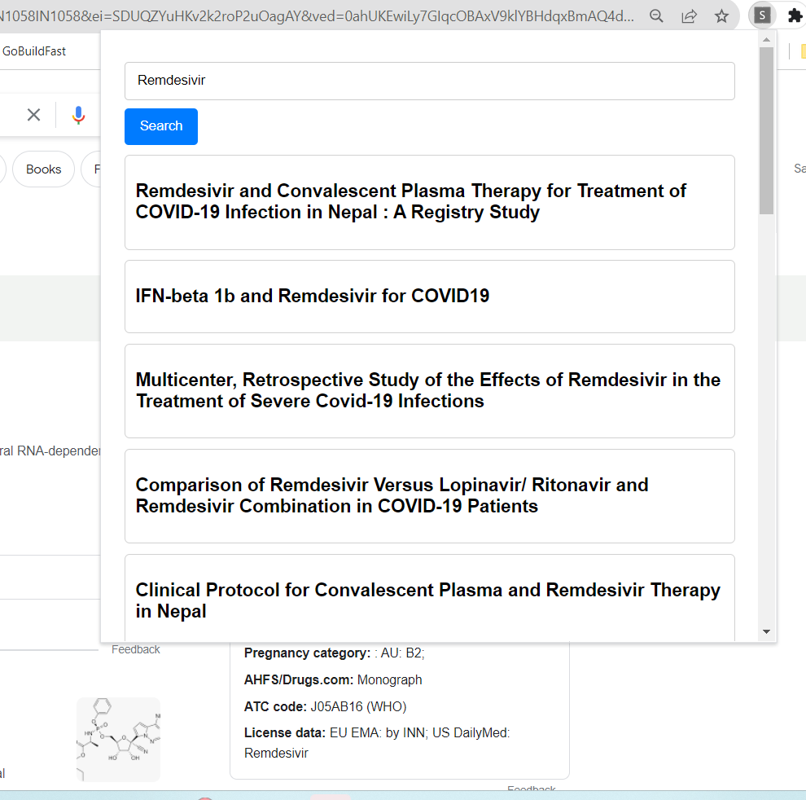

# **Sinequa Search Chrome Extension**

**Sinequa Search Chrome Extension allows users to quickly search in Sinequa directly from their browser toolbar or by selecting text on any webpage.**



## **Features**

- **Instant Access**: Click the extension icon to open a search bar and search Sinequa right away.
- **Text Selection Search**: Simply double-click on any word in a webpage to trigger the search and view results.
- **Clean UI**: Display search results in a clean and structured format.
- **Quick Installation**: Easy setup with the provided package. (make sure to change the hostname in all locations to your sinequa instance.)

## **Installation**

Clone this repository:

```
git clone https://github.com/shravanv90/SinequaBrowserExtension.git
```

Navigate to **chrome://extensions/** in your Chrome browser.

Enable "Developer mode" in the top right corner.

Click on "Load unpacked" and select the directory where you cloned this repository.

The extension should now be installed and visible in your Chrome extensions bar.

## **Usage**

**Toolbar Search**:

- Click on the extension icon in the Chrome toolbar.
- Enter your search query and hit the search button.

## **Development**

To contribute or modify this extension:

1.  Clone the repository.
2.  Make your changes.
3.  Follow the installation steps to test the extension locally.
4.  Create a pull request with your proposed changes.
